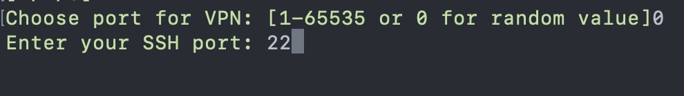
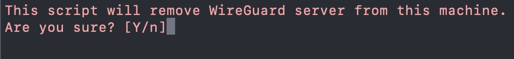

# Easy WireGuard Server
Script to easily configure the WireGuard server. You can select desired action in `./easy_wireguard.sh` script and it will guide you through the process.

## First step
Maybe you wil need install *curl*. You can do it with

`apt --yes install curl`

Download and run script with:
```
curl -O https://raw.githubusercontent.com/bllizard22/easy-wireguard-server/main/easy_wireguard.sh
chmod +x easy_wireguard.sh
./easy_wireguard.sh
```

You will be prompted to pick the action


## Setup server

When prompted enter any number from 1 to 65535 for VPN connetion or 0 to assign random value. If you use SSH connection enter port number for the rule in Firewall.



After setup you can manually run `./add_client.sh` to generate new peer.


## Add new client (peer)

You will be prompted to choose whether to output the result as QR-code or configuration file.


QR-code is suitable for smartphones and tablets, for desktop devices it is better to choose config.


## Remove server from this machine

This option will remove all your clients and server configs and WireGuard service.



If you need to reinstall server run `./easy_wireguard.sh` again and choose **Setup server** option
